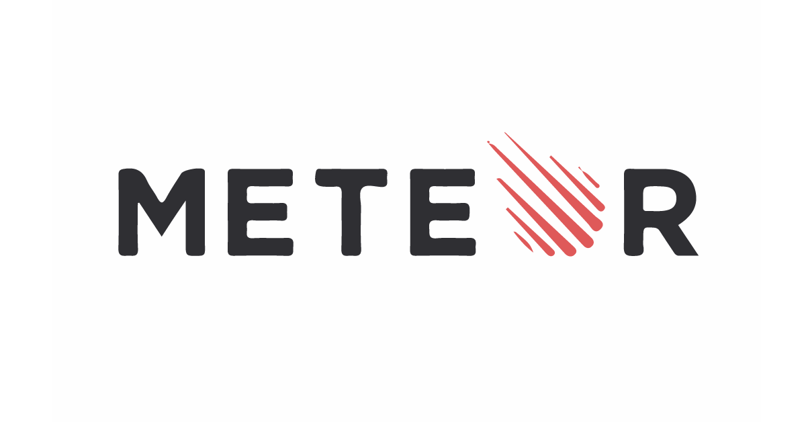
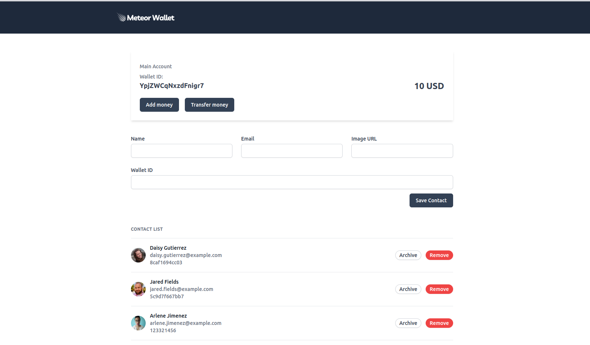
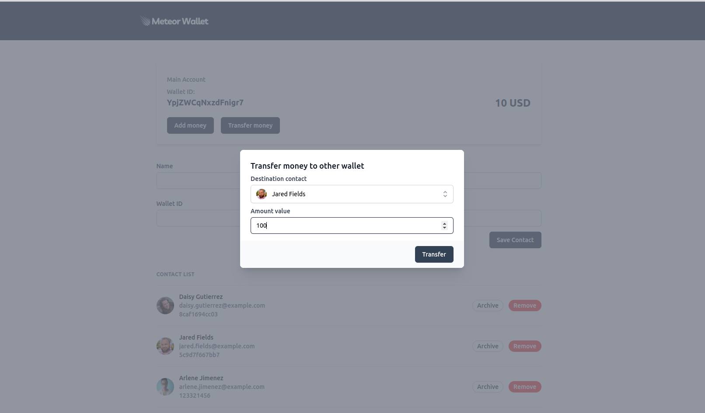

<div align="center" style="margin-bottom: 20px;">
  <h1>MeteorJS Digital Wallet Project</h1>
  <p align="center">
    
    
    
    
  </p> 

  
</div>

### About project
This is a project made in the meteorJS course, it is a digital wallet with functions to add and transfer values, add contacts among other functions, and the purpose of the project was to test the technologies of the fullstack meteor framework.

### Run this project
```bash
# clone this project
$ git clone https://github.com/jefferson1104/digital-wallet-meteorjs.git

# access the project folder
$ cd digital-wallet-meteorjs

# install dependencies and run project
$ meteor

# access project client in your browser
localhost:3000

# access mongodb database using a client
localhost:3001

# access mongodb with the command line 
$ meteor mongo
```

### Screenshots
<p align="center">
  
  
</p>